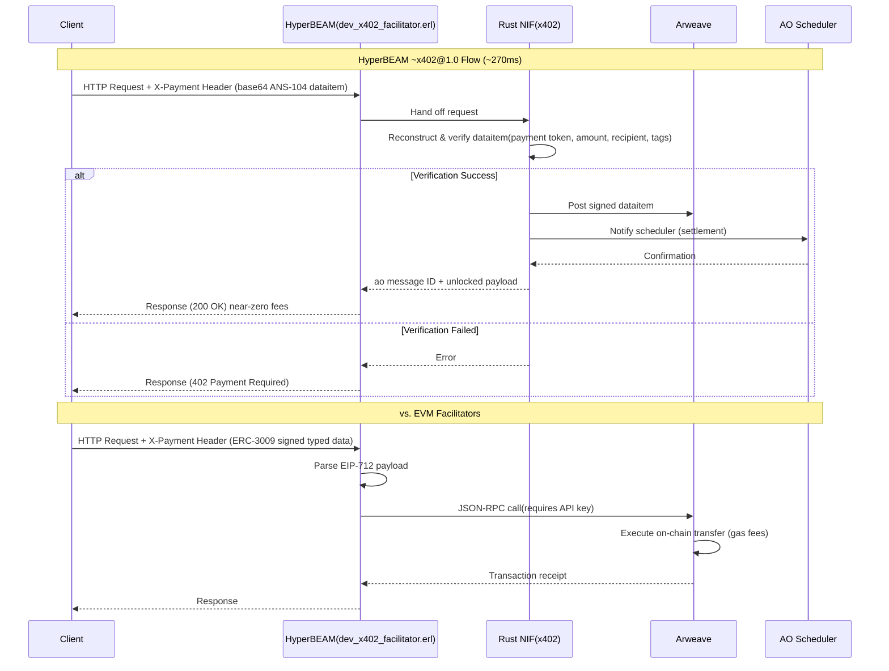

## About
The `~x402@1.0` device is the first x402-compliant facilitator implemented with native ao token support, built as a HyperBEAM device (NIF). This facilitator's API follows the spec used in [x402-rs](https://github.com/x402-rs/x402-rs).

> **N.B:** The `~x402@1.0` is an early WIP facilitator with partial x402-standard API compatibility. Promising work is being done, but treat it as a PoC for now.

## The Why
Following the x402 hype mid-October 2025 and its adoption within the ai agents stack, we asked ourselves: is there any better compute platform for ai agents than ao? Unbiasedly speaking, no. ao's alien compute enables functionalities like onchain verifiable LLMs (already live on the network), API-keyless autonomous trading agents, permissionless access to Arweave's datalake (WeaveDrive), etc.

So following that hype, we thought, if a network should be supported in the x402 stack, it's the ao network (and its token standard). Additionally, the encapsulation of the `~x402@1.0` device in the HyperBEAM OS exposes the facilitator natively to the ao canonical stack. To put it shortly: this device can be integrated into an existing EVM/SOL/* x402 facilitator, adding ao support (maintaining the API schema compatibility) AND offering additional routes for trustless compute infra for ai agents.

## Advantages
Compared to EVM-based facilitators, this HyperBEAM device offers:

* ~270ms total latency for the complete request lifecycle
* native payment history storage via ao's Arweave settlement (GraphQL, state lookup)
* potential native route to offer ao's compute alongside the payments railway through a single facilitator
* partial-compatibility with the x402 facilitator API standard
* micropayments support with near-zero gas fees
* no reliance on API keys to function (no JSON-RPC API keys needed)
* support for AR/ETH/SOL ANS-104 signatures

## Roadmap
| feature | description + status |
| :-------------: |:-------------:|
| x402-rs API schema minimal compatibility      | done    |
| Client Library      | done    |
| ao tokens support      | done    |
| payments storage     | done (native feature via ao)   |
| server siddleware     | provide ready-to-use integration for Rust web frameworks such as axum and tower - wip   |
| integration in an x402-rs fork    | routing ao requests to `~x402@1.0` from an EVM/SOL facilitator - wip  |

## Technical Overview

On HyperBEAM’s `~x402@1.0` device, the client’s X-Payment` header is an AO message, signed by the user serialised as base64 string but not posted to Arweave – technically speaking, a signed ANS-104 dataitem that follows the ao protocol.

The HTTP request received by the [dev_x402_facilitator.erl](../../src/dev_x402_facilitator.erl) module is handed to the Rust NIF (x402), where the NIF reconstructs and verifies the dataitem integrity (payment token, transfer amount, Recipient, ao protocol tags, etc), then posts it to the signed dataitem to Arweave and make AO scheduler aware of the message (payment settlement); on success, the erlang device’s counterpart returns the ao message ID along with the unlocked payload data, the whole process takes under a 300ms with near-zero fees, beating the EVM counterpart on speed and price. For an in-practice example, check out the complete flow test [here](./src/./lib.rs) and this [onchain proof](https://www.ao.link/#/message/RoaOrXQZjG7446LrO-EJ1kAybcYDAjQBvw65Jom4H5c)

On the other hand, EVM facilitators (e.g. x402-rs) have the same HTTP schema but the payment is an [ERC‑3009](https://eips.ethereum.org/EIPS/eip-3009) `transferWithAuthorization`: the client signs EIP‑712 typed data, the facilitator’s server parses the payload, talks to the target target chain via JSON-RPC (in most cases requires API keys to not get rate limited), and spends gas to execute the transfer on-chain before responding.  

## License
Licensed at your option under either of:

* [Apache License, Version 2.0](./LICENSE-APACHE)
* [MIT License](./LICENSE-MIT)

## Contribution
Unless you explicitly state otherwise, any contribution intentionally submitted for inclusion in the work by you, as defined in the Apache-2.0 license, shall be dual licensed as above, without any additional terms or conditions.